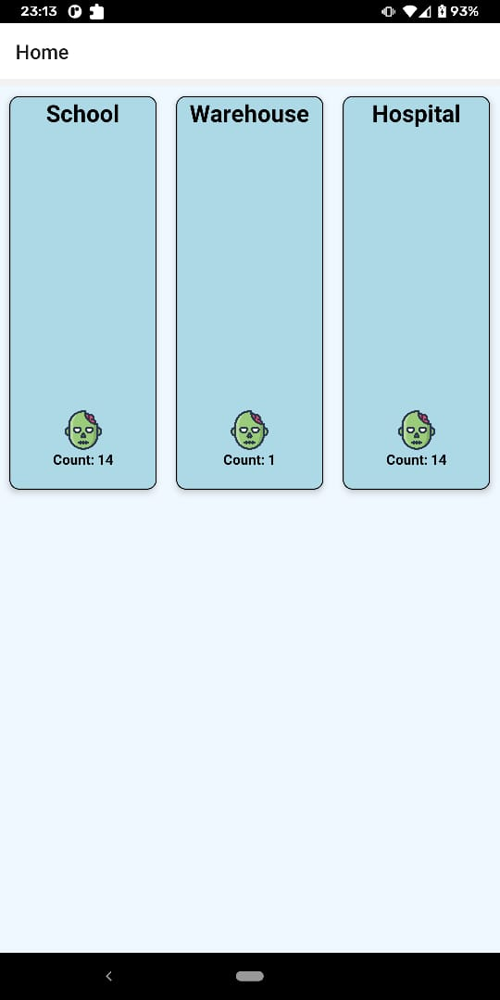
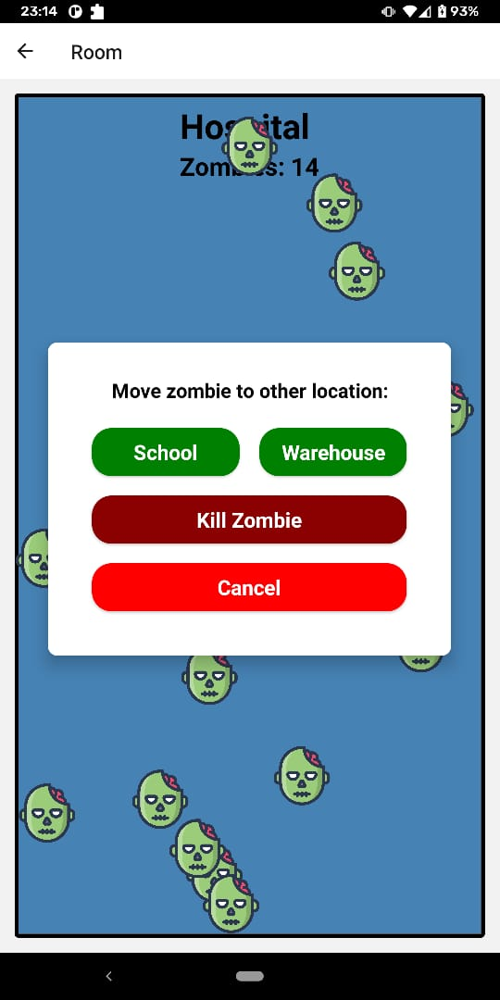

# zombie-tracker
---
### Installation
#### Backend
``cd backend/ && yarn install``

``yarn start``

#### Frontend

``cd frontend/ && yarn install``

#### Android
``yarn android``

#### iOS
``cd ios/ && pod install``

``cd .. && yarn ios``

---------

#### Known issues
- When you initially move a zombie, it gets reset to the initial position. After the first move, it works properly.

- When a zombie is clicked, the dialog gets triggered. The parent view gets re-rendered, which is causing some animation issues.

### Screenshots

